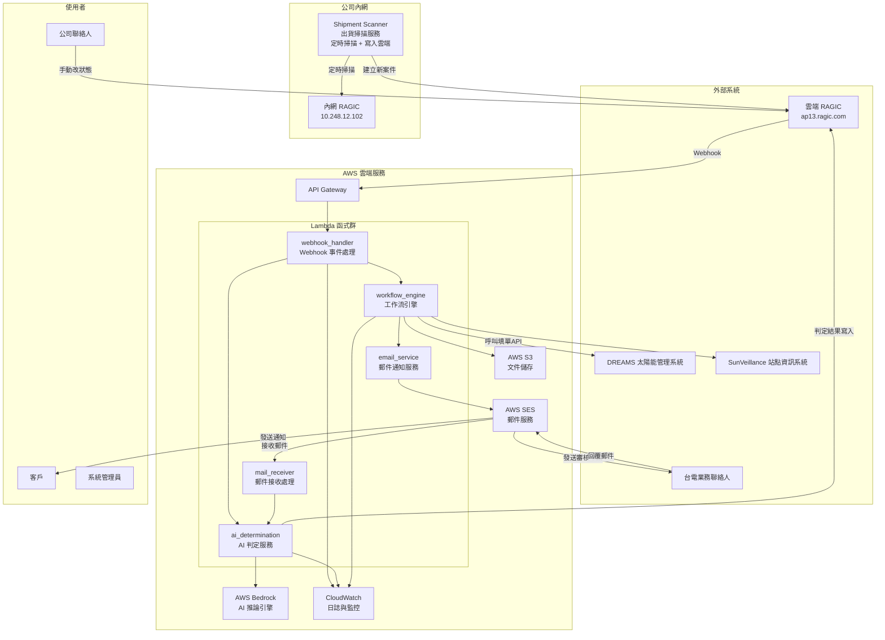
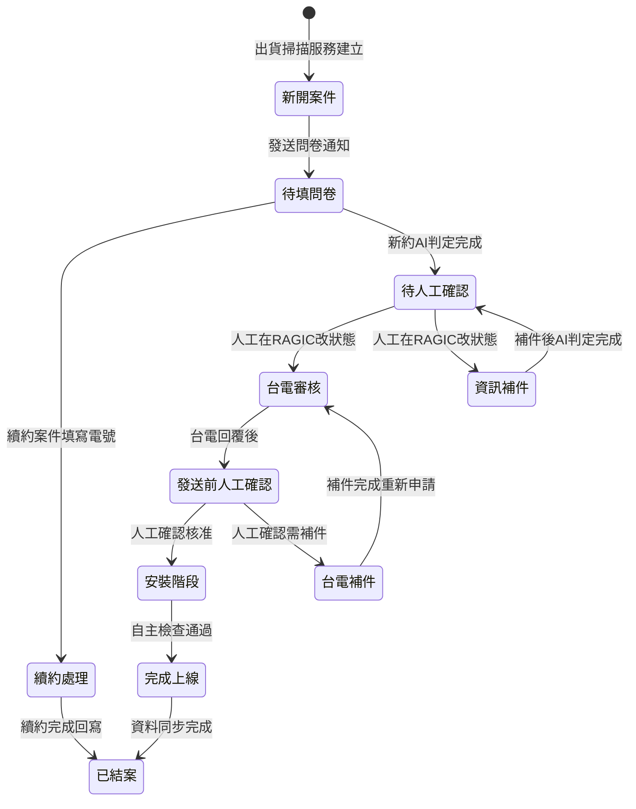
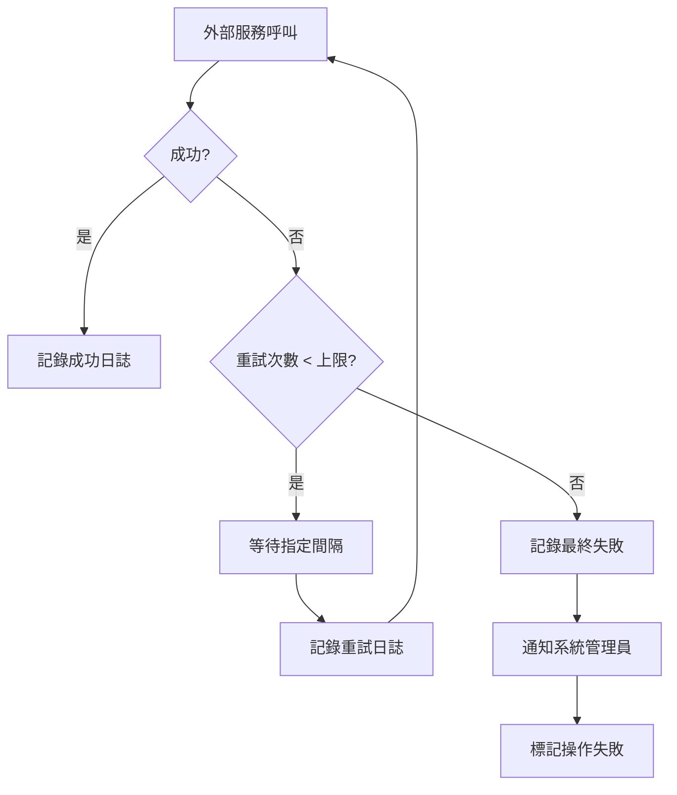

# 設計文件

## 概述

本設計文件描述 DREAMS 申請流程自動化工作流系統的技術架構與實作方案。系統採用事件驅動架構（Event-Driven Architecture），以 AWS Lambda 為核心運算單元，透過 API Gateway 接收 RAGIC Webhook 事件、AWS SES 接收台電回覆郵件，並利用 AWS Bedrock 進行 AI 文件比對與語意分析。

系統核心設計理念：
- **事件驅動**：所有流程推進由 RAGIC Webhook 事件（含人工狀態變更）與郵件事件觸發
- **無伺服器架構**：使用 AWS Lambda 實現按需運算，降低維運成本
- **RAGIC 為狀態中心**：案件狀態的唯一 source of truth 為雲端 RAGIC 案件管理表單，不使用獨立資料庫
- **人機協作**：AI 輔助判定結果寫入 RAGIC，人工在 RAGIC 上確認後手動改狀態觸發下一步
- **續約/新約分流**：根據案件類型走不同流程路徑，續約案件走簡化流程

## 架構

### 系統架構圖



### 案件狀態轉換圖



## 元件與介面

### 1. 出貨掃描服務（ragic-shipment-scanner）

**職責**：部署於公司內網電腦的常駐程式（獨立 repository），定時掃描內網 RAGIC 出貨管理表單，發現符合條件的訂單後直接透過雲端 RAGIC API 建立新案件，由 RAGIC Webhook 觸發後續流程。

**介面**：
```python
class ShipmentScanner:
    """出貨掃描服務常駐程式"""
    
    def __init__(
        self, 
        intranet_ragic_url: str,          # http://10.248.12.102
        cloud_ragic_url: str,             # https://ap13.ragic.com
        cloud_ragic_api_key: str,
        scan_schedule: str                # cron 表達式，如 "0 9 * * *"
    ):
        pass
    
    def run(self) -> None:
        """啟動主迴圈，依排程定時執行掃描"""
        pass
    
    def execute_daily_scan(self) -> ScanResult:
        """
        執行每日出貨掃描
        
        流程：
        1. 查詢內網 RAGIC 出貨管理表單（已出貨 + 料號 19.D1M01.007）
        2. 逐筆透過雲端 RAGIC API 建立新案件記錄
        3. 雲端 RAGIC 自動觸發 Webhook → AWS 後續流程
        4. 記錄掃描結果
        """
        pass

@dataclass
class ScanResult:
    scan_time: str                        # 掃描時間 (ISO 8601)
    total_shipped_orders: int             # 發現的已出貨訂單數
    new_cases_created: int                # 新建立的案件數
    skipped_existing: int                 # 已存在跳過的案件數
    errors: list[str]                     # 錯誤訊息

class IntranetRagicClient:
    """內網 RAGIC API 客戶端"""
    
    BASE_URL = "http://10.248.12.102"
    
    def get_shipped_orders(
        self, 
        status: str = "已出貨", 
        part_number: str = "19.D1M01.007"
    ) -> list[dict]:
        """查詢出貨管理表單中符合條件的訂單"""
        pass
```

### 2. Webhook 事件處理器（webhook_handler）

**職責**：接收並驗證 RAGIC Webhook 請求，路由至對應的處理邏輯。統一處理所有來自雲端 RAGIC 的事件，包含新案件建立、問卷回覆、補件回覆。

**介面**：
```python
# Lambda Handler
def lambda_handler(event: dict, context: LambdaContext) -> dict:
    """
    接收 API Gateway 轉發的 RAGIC Webhook 事件
    
    Args:
        event: API Gateway 事件，包含 headers、body
        context: Lambda 執行上下文
    
    Returns:
        HTTP 回應，包含 statusCode 與 body
    """
    pass

# 內部介面
def validate_webhook_source(headers: dict, body: str) -> bool:
    """驗證 Webhook 請求來源合法性"""
    pass

def classify_webhook_event(payload: dict) -> WebhookEventType:
    """
    根據表單 ID 與欄位內容區分事件類型（第一層分類）
    
    Returns:
        WebhookEventType:
          - NEW_CASE_CREATED: 來自 business-process2/2 且狀態欄位(1015456)為「新開案件」
          - CASE_STATUS_CHANGED: 來自 business-process2/2 的其他狀態變更
          - RENEWAL_QUESTIONNAIRE: 來自 work-survey/7 且案件類型為「續約」
          - NEW_CONTRACT_FULL_QUESTIONNAIRE: 來自 work-survey/7 且案件類型為「新約」
          - SUPPLEMENTARY_QUESTIONNAIRE: 來自 work-survey/9 的補件問卷回覆
    
    注意：
      - business-process2/2 的 payload 直接包含 1015456（案件狀態），可直接判斷
      - work-survey/7 的 payload 不包含案件狀態，需由下游 Lambda 從 DREAMS_APPLY_ID
        解析 ragicId 後查詢案件管理表取得案件類型（新約/續約）
      - work-survey/9 的 payload 不包含案件狀態，需由下游 Lambda 從 DREAMS_APPLY_ID
        解析 ragicId 後查詢案件管理表的 1015456 欄位，區分「資訊補件」或「台電補件」
    """
    pass

# 下游 Lambda 的二次分類邏輯（workflow_engine / ai_determination）
def resolve_case_context(payload: dict) -> dict:
    """
    從問卷/補件 webhook payload 中解析案件上下文
    
    流程：
    1. 從 payload 取得 DREAMS_APPLY_ID（欄位 ID 從 ragic_fields.yaml 讀取）
    2. 以 "-" split 取最後一段作為案件 ragicId
    3. 呼叫 RAGIC API: GET business-process2/2/{ragicId}
    4. 從回應中讀取 1015456（案件狀態）及其他必要欄位
    
    Returns:
        dict: {"ragic_id": str, "case_status": str, "case_type": str, ...}
    """
    pass
```

### 3. AI 判定服務（ai_determination）

**職責**：使用 AWS Bedrock 進行佐證文件比對與台電回覆語意分析。

**欄位映射配置**：AI 判定結果的寫入目標欄位定義於 `ai_determination/field_mapping.yaml`。該配置檔記錄問卷表單與案件管理表單之間的欄位對應關係。

⚠️ 注意：欄位 ID 為專案起始時的設定，RAGIC 表單設計可能因修改而有出入，請依實際 RAGIC 表單設定更新配置檔。

**補件參數對應規則**：
- 補件參數代碼為 A~N（共 14 個代碼），對應關係定義於 `field_mapping.yaml` 的 `supplement_param_codes`
- A=審訖圖、B=細部協商、C=縣府同意備案函文、D=購售電契約、E=併聯審查意見書、F=案場詳細地址、G=電號、H=裝置量、I=案場類型、J=縣府同意備案函文編號、K=售電方式、L=併聯方式/併聯點型式/併聯點電壓（群組）、M=責任分界點型式/責任分界點電壓（群組）、N=逆變器匯總
- **群組邏輯**：併聯方式、併聯點型式、併聯點電壓三項為同一群組（代碼 L），任一項 Fail 則三項一起補件；責任分界點型式、責任分界點電壓兩項為同一群組（代碼 M），任一項 Fail 則兩項一起補件

**補件通知郵件設計（2026-05-12 實測通過）**：
- 主旨：`【DREAMS補件】_{DREAMS_APPLY_ID}_案場資訊釐清`
- 郵件內容分為兩個表格：
  - **資料比對表**（代碼 F~N）：僅列 Fail 的欄位項目，欄位包含「資料欄位」「提供資料」及各佐證文件的 LLM 提取值。文件欄位按有值數量排序（資料多的排前面）。LLM 提取值自動去除 `[依據]` 後綴
  - **佐証文件提供表**（代碼 A~E）：列出 5 份佐證文件，Fail 的打 V 標記。維持固定順序（審訖圖→細部協商→縣府同意備案函文→購售電契約→併聯審查意見書）
- 補件問卷連結格式：`https://ap13.ragic.com/solarcs/work-survey/9?ragic-web-embed=true&webaction=form&ver=new&version=2&pfv1016649={DREAMS_APPLY_ID}&pfv1016652={案場名稱}&pfv1016697={補件代碼}`
  - pfv 參數對應：`pfv{補件問卷欄位ID}` = 案件管理表欄位值
  - 補件代碼由程式邏輯產生（`|` 分隔，如 `A|F|L`）
  - 其他 pfv 參數可在 `email_config.yaml` 的 `dynamic_params` 中新增
- 資料來源：所有欄位值直接從 Webhook payload 讀取（payload 包含案件管理表的所有欄位值）

**補件問卷回覆後 AI 重新判定流程**：
- 觸發：客戶填寫補件問卷（work-survey/9）→ Webhook → `SUPPLEMENTARY_QUESTIONNAIRE`
- 流程：
  1. 從 payload 的 DREAMS_APPLY_ID（欄位 `1016649`）解析案件管理表 ragicId
  2. 從案件管理表（business-process2/2/{ragicId}）讀取**原有資料 & 文件**
  3. 將原有資料轉換為問卷欄位格式（reverse direct_mapping）
  4. 用補件問卷 payload 的新值**覆蓋**對應欄位（非空值才覆蓋）
  5. 用合併後的資料下載文件（新上傳的文件覆蓋舊的）
  6. 執行 AI 判定（與首次判定相同邏輯）
  7. 所有結果回寫案件管理表 + 狀態更新為「待人工確認」
- 欄位映射定義於 `field_mapping.yaml`：
  - `supplement_to_case_mapping`：補件問卷欄位 ID → 案件管理表欄位 ID
  - `supplement_to_questionnaire_mapping`：補件問卷欄位 ID → 原始問卷欄位 ID（供 AI 判定使用）
- ⚠️ **TODO**：依案件狀態區分寫入目標欄位：
  - 狀態 = 「資訊補件」→ 判讀結果寫入 `questionnaire_result_mapping` 欄位
  - 狀態 = 「台電補件」→ 判讀結果寫入 `taipower_result_mapping` 欄位
  - 若狀態不是上述兩者 → 發異常通知，不執行判定
- ⚠️ **TODO**：DREAMS CreatePlantApplication API 回傳格式確認 — 當 `IsSuccess=true` 但 `Data.id=0` 時，應視為電號不存在（等 API 作者修正回傳格式）
- **群組邏輯**：併聯方式、併聯點型式、併聯點電壓三項為同一群組（代碼 L），任一項 Fail 則三項一起補件；責任分界點型式、責任分界點電壓兩項為同一群組（代碼 M），任一項 Fail 則兩項一起補件

**DREAMS_APPLY_ID 解析規則**：
- Webhook payload 中包含 DREAMS_APPLY_ID 欄位，但**不同表單使用不同的欄位 ID**：
  - 案件管理表（business-process2/2）：欄位 ID = `1016557`（定義於 `ragic_fields.yaml` 的 `case_management.dreams_apply_id`）
  - 問卷表單（work-survey/7）：欄位 ID = `1016284`（定義於 `ragic_fields.yaml` 的 `questionnaire_form.dreams_apply_id`）
- 格式為 `{出貨單號}-{ragicId}`，例如 `TEST0011-26`
- 以 "-" split 取**最後一段**即為案件管理表單的 RAGIC record ID
- 此 ID 用於 API URL：`https://ap13.ragic.com/solarcs/business-process2/2/{record_id}`
- `case_resolver.py` 的 `resolve_ragic_id_from_payload()` 會依序嘗試多個欄位 ID

**問卷/補件 Webhook 的二次分類流程**：
- `work-survey/7`（資訊問卷）：webhook_handler 先分類為 `NEW_CONTRACT_FULL_QUESTIONNAIRE`（預設），下游 Lambda 再從案件管理表查詢案件類型欄位，若為「續約」則改走續約流程
- `work-survey/9`（補件問卷）：webhook_handler 分類為 `SUPPLEMENTARY_QUESTIONNAIRE`，下游 Lambda 從案件管理表查詢 `1015456`（案件狀態），根據狀態值區分：
  - 狀態 = 「資訊補件」→ 走資訊補件流程（AI 重新判定）
  - 狀態 = 「台電補件」→ 走台電補件流程（重新申請台電）

**AI 判定流程（問卷回覆觸發後）**：
1. 收到 Webhook（來自 work-survey/7，payload 已包含所有問卷欄位值與附件欄位值）
2. 從 payload 的 DREAMS_APPLY_ID（欄位 `1016284`）解析案件管理表的 record ID
3. **直接使用 webhook payload 作為問卷資料**（不需再呼叫 RAGIC API 查詢問卷記錄）
4. **直接從 payload 的附件欄位值下載文件**（格式 `{fileKey}@{fileName}`，使用 RAGIC file download API）
   - 附件欄位 ID：`1014650`（審訖圖）、`1014651`（縣府同意備案函文）、`1014652`（細部協商）、`1014653`（購售電契約）、`1014654`（併聯審查意見書）
   - 下載 URL：`{file_download_url}?a={account_name}&f={url_encoded_file_value}`
5. 逐份佐證文件進行 AI 判定（Bedrock）
6. 組合完整寫入資料：直接欄位值 + AI 判定值 + Pass/Fail 結果 + 狀態「待人工確認」
7. 一次性將所有資料寫入案件管理表單（單次 RAGIC POST 至 `business-process2/2/{record_id}`）

⚠️ **重要設計決策**：RAGIC Webhook payload 的 `data[0]` 已包含觸發記錄的所有欄位值（含附件欄位），因此 AI 判定流程**不需要額外呼叫 RAGIC API 查詢問卷記錄**，直接從 payload 取值即可。這與參考實作（refer/0031_CreateNewDreams）的做法一致。

**Pass/Fail 判定邏輯（Per-Field 粒度）**：
- 判定以**欄位（field）為單位**，非以文件為單位
- LLM 從文件中提取值且與問卷表單值**匹配** → 該欄位 **Pass**
- LLM 從文件中提取值但與問卷表單值**不匹配** → 該欄位 **Fail**（此 Fail 具有覆蓋性，即使其他文件對同欄位判定為 Pass，最終仍為 Fail）
- 若**所有文件**對某欄位皆回傳 null / not found → 該欄位 **Fail**
- 單一文件對某欄位回傳 null / not found → **忽略**（不計為 Pass 也不計為 Fail）
- 所有結果欄位**一律寫入**（空字串清除舊值），確保每次判定結果完整覆蓋

**逆變器（Inverter）格式規則**：
- 輸出格式：`{brand}|{model}|{quantity}`，多組以 `", "` 連接
- 範例：`HUAWEI|SUN2000-100KTL-M1|8, HUAWEI|SUN2000-40KTL-M3|2`
- LLM 從佐證文件中提取逆變器的品牌（brand）、型號（model）、數量（quantity）
- 比對對象為問卷子表格 `_subtable_1014629` 中的逆變器資料

**LLM 結果欄位格式（含依據文字）**：
- 結果欄位（如 `1016519`、`1016520` 等）包含提取值與出處依據
- 格式：`"extracted_value\n[依據] 第X頁：原文內容"`
- 此格式讓人工審核時可直接看到 LLM 判定的原文出處

**Bedrock 配置**：
- Model：`jp.anthropic.claude-sonnet-4-6`
- Max tokens：`8192`
- Timeout：`900` 秒

⚠️ **Prompt 規則同步**：AI 判定使用的 prompt 包含從參考專案（`refer/0031_CreateNewDreams`）同步的完整規則，涵蓋：
- site_type（場址類型）判定規則
- selling_method（售電方式）判定規則
- connection/demarcation point（併接點/責任分界點）分離規則
- 格式正規化指引（地址、數值、日期等）
- 回應範例（response examples）

**介面**：
```python
@dataclass
class DocumentComparisonResult:
    document_id: str
    document_name: str
    status: Literal["pass", "fail"]
    reason: str

@dataclass
class ComparisonReport:
    case_id: str
    overall_status: Literal["all_pass", "has_failures"]
    results: list[DocumentComparisonResult]
    timestamp: str

def compare_documents(
    questionnaire_data: dict,
    supporting_documents: list[bytes],
    document_metadata: list[dict]
) -> ComparisonReport:
    """
    比對佐證文件與問卷資料
    
    Args:
        questionnaire_data: 問卷填寫資料（結構化）
        supporting_documents: 5 份佐證文件的 PDF 二進位內容
        document_metadata: 各文件的元資料（名稱、對應欄位）
    
    Returns:
        ComparisonReport: 結構化判定結果
    """
    pass

@dataclass
class SemanticAnalysisResult:
    category: Literal["approved", "rejected"]
    confidence_score: float
    rejection_reason_summary: str | None
    raw_analysis: str

def analyze_taipower_reply(
    email_content: str,
    email_subject: str
) -> SemanticAnalysisResult:
    """
    分析台電回覆郵件語意
    
    Args:
        email_content: 郵件本文內容
        email_subject: 郵件主旨
    
    Returns:
        SemanticAnalysisResult: 結構化分析結果
    """
    pass
```

### 4. 工作流引擎（workflow_engine）

**職責**：管理案件狀態轉換、協調各服務元件、執行業務邏輯。

**介面**：
```python
class CaseStatus(str, Enum):
    NEW_CASE_CREATED = "新開案件"
    PENDING_QUESTIONNAIRE = "待填問卷"
    PENDING_MANUAL_CONFIRM = "待人工確認"
    INFO_SUPPLEMENT = "資訊補件"
    TAIPOWER_REVIEW = "台電審核"
    PRE_SEND_CONFIRM = "發送前人工確認"
    TAIPOWER_SUPPLEMENT = "台電補件"
    INSTALLATION_PHASE = "安裝階段"
    ONLINE_COMPLETED = "完成上線"
    CASE_CLOSED = "已結案"
    RENEWAL_PROCESSING = "續約處理"

class CaseType(str, Enum):
    NEW_CONTRACT = "新約"
    RENEWAL = "續約"

# 合法狀態轉換定義
VALID_TRANSITIONS: dict[CaseStatus, list[CaseStatus]] = {
    CaseStatus.NEW_CASE_CREATED: [
        CaseStatus.PENDING_QUESTIONNAIRE     # 發送問卷通知後更新
    ],
    CaseStatus.PENDING_QUESTIONNAIRE: [
        CaseStatus.PENDING_MANUAL_CONFIRM,   # 新約 AI 判定完成
        CaseStatus.RENEWAL_PROCESSING        # 續約案件分流
    ],
    CaseStatus.RENEWAL_PROCESSING: [
        CaseStatus.CASE_CLOSED               # 續約完成直接結案
    ],
    CaseStatus.PENDING_MANUAL_CONFIRM: [
        CaseStatus.TAIPOWER_REVIEW,          # 人工在 RAGIC 改狀態（合格）
        CaseStatus.INFO_SUPPLEMENT           # 人工在 RAGIC 改狀態（不合格）
    ],
    CaseStatus.INFO_SUPPLEMENT: [
        CaseStatus.PENDING_MANUAL_CONFIRM    # 補件後 AI 判定完成
    ],
    CaseStatus.TAIPOWER_REVIEW: [
        CaseStatus.PRE_SEND_CONFIRM,         # 台電回覆後進入發送前人工確認
    ],
    CaseStatus.PRE_SEND_CONFIRM: [
        CaseStatus.INSTALLATION_PHASE,       # 人工確認核准，進入安裝階段
        CaseStatus.TAIPOWER_SUPPLEMENT       # 人工確認需補件
    ],
    CaseStatus.TAIPOWER_SUPPLEMENT: [
        CaseStatus.TAIPOWER_REVIEW           # 補件完成重新申請
    ],
    CaseStatus.INSTALLATION_PHASE: [
        CaseStatus.ONLINE_COMPLETED          # 自主檢查通過
    ],
    CaseStatus.ONLINE_COMPLETED: [
        CaseStatus.CASE_CLOSED               # 資料同步完成
    ],
}

def transition_case_status(
    case_id: str,
    new_status: CaseStatus,
    reason: str
) -> bool:
    """
    執行案件狀態轉換
    
    Args:
        case_id: 案件編號
        new_status: 目標狀態
        reason: 變更原因
    
    Returns:
        bool: 轉換是否成功
    
    Raises:
        InvalidTransitionError: 當轉換路徑不合法時
    """
    pass

def get_case_status(case_id: str) -> CaseStatus:
    """查詢案件當前狀態"""
    pass

def get_case_history(case_id: str) -> list[StatusChangeRecord]:
    """查詢案件狀態變更歷史"""
    pass
```

### 5. 郵件通知服務（email_service）

**職責**：統一管理所有電子郵件的發送，包含範本管理、CC 抄送、RAGIC mail loop 整合與發送紀錄。

**配置檔**：`email_service/email_config.yaml`，定義：
- 寄件人名稱與 email（從環境變數讀取）
- 收件人欄位 ID（從 Webhook payload 取得客戶 email）
- Payload 欄位 ID 對應（DREAMS_APPLY_ID、客戶 email、出貨單號等，RAGIC 表單修改時僅需改此處）
- CC 抄送設定：靜態名單 + RAGIC 表單 mail loop（`{account_id}.{tab_name}.{sheet_id}.{record_id}@tickets.ragic.com`）
- 各郵件類型的主旨範本（支援 `{dreams_apply_id}` 等變數替換）、HTML 範本檔案、連結 pfv 參數

**介面**：
```python
class EmailType(str, Enum):
    QUESTIONNAIRE_NOTIFICATION = "問卷通知"
    SUPPLEMENT_NOTIFICATION = "補件通知"
    TAIPOWER_APPLICATION = "台電審核申請"
    TAIPOWER_SUPPLEMENT = "台電補件通知"
    APPROVAL_NOTIFICATION = "核准通知"
    ACCOUNT_ACTIVATION = "帳號啟用通知"

@dataclass
class EmailRequest:
    email_type: EmailType
    case_id: str
    recipient_email: str
    template_data: dict
    attachments: list[Attachment] | None = None
    cc_emails: list[str] | None = None

@dataclass
class EmailResult:
    success: bool
    message_id: str | None
    error_message: str | None
    sent_at: str | None

def send_email(request: EmailRequest) -> EmailResult:
    """
    發送電子郵件（含 CC 抄送）
    
    CC 名單自動組合：
    1. request.cc_emails（呼叫端指定）
    2. email_config.yaml 中的 cc.static_list
    3. RAGIC mail loop 地址（根據 case_id 動態產生）
    
    Args:
        request: 郵件發送請求
    
    Returns:
        EmailResult: 發送結果
    """
    pass

def get_recipient_email(case_id: str) -> str:
    """從 RAGIC 表單編號取得收件人電子郵件地址"""
    pass
```

### 6. 郵件接收處理器（mail_receiver）

**職責**：處理 AWS SES 接收的台電回覆郵件，觸發語意分析流程。

**介面**：
```python
def lambda_handler(event: dict, context: LambdaContext) -> dict:
    """
    處理 SES 接收的郵件事件
    
    流程：
    1. 從 S3 讀取郵件原始內容
    2. 解析郵件主旨、本文、附件
    3. 比對寄件人是否為台電業務聯絡人
    4. 觸發 AI 語意分析
    5. 根據分析結果更新案件狀態
    """
    pass

def parse_email_content(raw_email: bytes) -> ParsedEmail:
    """解析原始郵件內容"""
    pass

def match_case_by_sender(sender_email: str, subject: str) -> str | None:
    """根據寄件人與主旨比對對應案件"""
    pass
```

### 7. DREAMS 填單 API 整合介面（dreams_api_client）

**職責**：封裝與 DREAMS 填單 API 的互動。該 API 由其他同仁開發維護，負責爬蟲填單與 PDF 下載，本專案僅負責呼叫與判讀回應。

**介面**：
```python
@dataclass
class DreamsApiResponse:
    """DREAMS 填單 API 回應"""
    success: bool                          # 是否成功填單
    case_number: str | None                # DREAMS 案號（成功時回傳）
    pdf_base64: str | None                 # 申請資料 PDF base64（成功時回傳）
    error_code: str | None                 # 錯誤代碼（失敗時回傳，如 "NO_ELECTRICITY_NUMBER"）
    error_message: str | None              # 錯誤訊息

class DreamsApiClient:
    """DREAMS 填單 API 客戶端"""
    
    def __init__(self, api_url: str | None = None, timeout: int = 60):
        """
        Args:
            api_url: DREAMS 填單 API URL（從環境變數 DREAMS_API_URL 讀取）
            timeout: 請求逾時秒數（預設 60 秒，因爬蟲填單較耗時）
        """
        pass
    
    def submit_application(self, case_id: str, case_data: dict) -> DreamsApiResponse:
        """
        呼叫 DREAMS 填單 API 進行申請表單填寫
        
        Args:
            case_id: RAGIC 案件 ID
            case_data: 案件相關資料（電號、客戶資訊等）
        
        Returns:
            DreamsApiResponse: API 回應結果
            - 成功：success=True, case_number 與 pdf_base64 有值
            - 無電號：success=False, error_code="NO_ELECTRICITY_NUMBER"
            - 其他失敗：success=False, error_code 與 error_message 有值
        """
        pass
```

### 8. RAGIC 整合介面（ragic_client）

**職責**：封裝與雲端 RAGIC 平台（https://ap13.ragic.com）的所有互動操作。內網 RAGIC 的存取由出貨掃描服務（ragic-shipment-scanner，獨立專案）負責。

**RAGIC API 使用規範**：

所有 RAGIC API 呼叫必須遵循以下規則：

1. **版本參數**：所有請求必須加入 `"v": 3` 與 `"api": ""` 參數，確保使用最新版 API
2. **欄位命名模式**：
   - `"naming": "EID"` → 回應資料以欄位 ID 為 key 值（適用於需要精確欄位 ID 操作的場景）
   - `"naming": "FNAME"` → 回應資料以欄位文字名稱為 key 值（適用於人類可讀的場景）
   - 本專案統一使用 `"naming": "EID"` 以確保欄位 ID 一致性
3. **寫入參數**：所有 POST（寫入/更新）請求必須加入以下 3 個參數，避免資料寫入錯誤：
   - `"doLinkLoad": "first"` — 觸發連結載入
   - `"doFormula": true` — 觸發公式計算
   - `"doDefaultValue": true` — 觸發預設值填入

**介面**：
```python
class CloudRagicClient:
    """雲端 RAGIC API 客戶端（https://ap13.ragic.com）"""
    
    BASE_URL = "https://ap13.ragic.com"
    
    def get_questionnaire_data(self, record_id: str) -> dict:
        """取得問卷填寫資料"""
        pass
    
    def get_supporting_documents(self, record_id: str) -> list[tuple[str, bytes]]:
        """取得佐證文件（檔名, 內容）"""
        pass
    
    def write_determination_result(self, case_id: str, result: ComparisonReport) -> None:
        """將 AI 判定結果寫入 RAGIC 案件管理表單（business-process2/2）"""
        pass
    
    def update_case_status(self, case_id: str, status: str) -> None:
        """更新 RAGIC 案件管理表單狀態（觸發 Webhook）"""
        pass
    
    def create_supplement_questionnaire(
        self, 
        case_id: str, 
        failed_items: list[str]
    ) -> str:
        """建立補件問卷，回傳問卷連結"""
        pass
    
    def update_case_record(self, case_id: str, update_data: dict) -> None:
        """回寫案件管理表單（用於續約結案回寫、駁回原因寫入等）"""
        pass
```

## 資料模型

### 案件資料模型（RAGIC 案件管理表單）

案件狀態與所有流程資料皆儲存於雲端 RAGIC 案件管理表單（https://ap13.ragic.com/solarcs/business-process2/2），作為唯一 source of truth。

```python
@dataclass
class CaseRecord:
    """對應 RAGIC 案件管理表單的一筆記錄"""
    ragic_id: str                         # RAGIC 記錄 ID（主鍵）
    case_type: CaseType                   # 案件類型（新約/續約）
    customer_name: str                    # 客戶姓名
    customer_email: str                   # 客戶電子郵件
    electricity_number: str | None        # 電號
    current_status: CaseStatus            # 當前狀態
    dreams_case_id: str | None            # DREAMS 系統案件 ID（台電審核階段才建立）
    taipower_contact_email: str | None    # 台電業務聯絡人郵件
    company_contact_email: str            # 公司聯絡人郵件
    renewal_site_id: str | None           # 續約案場 ID（僅續約案件）
    ai_determination_result: dict | None  # AI 判定結果（JSON）
    taipower_reply_result: dict | None    # 台電回覆語意分析結果（JSON）
    created_at: str                       # 建立時間
    updated_at: str                       # 最後更新時間

@dataclass
class AIJudgmentRecord:
    """AI 判定結果，寫入 RAGIC 案件管理表單的 JSON 欄位"""
    case_id: str                          # 案件編號
    judgment_type: Literal["document_comparison", "semantic_analysis"]
    timestamp: str                        # 判定時間
    result: dict                          # 判定結果（ComparisonReport 或 SemanticAnalysisResult）
    model_id: str                         # 使用的 Bedrock 模型 ID
```

### 郵件發送紀錄模型（S3 JSON）

郵件發送紀錄存放於 S3，供日後查詢與除錯。

```python
@dataclass
class EmailLog:
    log_id: str                           # 紀錄唯一 ID
    case_id: str                          # 關聯案件編號
    email_type: EmailType                 # 郵件類型
    recipient: str                        # 收件人
    sent_at: str | None                   # 發送時間
    status: Literal["sent", "failed", "retrying"]
    message_id: str | None                # SES Message ID
    retry_count: int                      # 重試次數
    error_message: str | None             # 錯誤訊息
```

### 儲存策略

| 資料類型 | 儲存位置 | 說明 |
|---------|---------|------|
| 案件狀態與基本資料 | 雲端 RAGIC (business-process2/2) | 唯一 source of truth |
| AI 判定結果 | 雲端 RAGIC + S3（備份） | 寫入 RAGIC 供人工檢視，S3 保留完整 JSON |
| 佐證文件 | 雲端 RAGIC (work-survey/7) | 客戶上傳的附件 |
| 郵件發送紀錄 | S3 | JSON 格式，90 天保留 |
| 操作日誌 | CloudWatch Logs | Lambda 執行日誌 |
| 出貨掃描服務日誌 | 本地檔案 | Scanner 執行紀錄 |


## 正確性屬性

*正確性屬性是一種在系統所有合法執行中都應成立的特徵或行為——本質上是對系統應做之事的形式化陳述。屬性作為人類可讀規格與機器可驗證正確性保證之間的橋樑。*

### 屬性 1：狀態機轉換合法性

*對於任何*案件的當前狀態與目標狀態組合，狀態轉換應當且僅當該轉換路徑存在於 VALID_TRANSITIONS 定義中時才能成功執行；所有不在合法路徑中的轉換嘗試都應被拒絕並拋出 InvalidTransitionError。

**驗證：需求 10.3**

### 屬性 2：狀態變更紀錄完整性

*對於任何*成功的案件狀態轉換，系統應在 RAGIC 案件管理表單中記錄狀態變更，且 CloudWatch Logs 中應包含對應的操作日誌，包含案件編號、原始狀態、目標狀態與變更原因。

**驗證：需求 10.4, 15.4**

### 屬性 3：佐證文件比對結果結構完整性

*對於任何*包含 5 份佐證文件與對應問卷資料的比對請求，AI 判定服務應回傳一份 ComparisonReport，其中恰好包含 5 筆 DocumentComparisonResult，每筆結果的 status 為 "pass" 或 "fail"，且 reason 為非空字串。

**驗證：需求 13.1, 13.2, 13.4**

### 屬性 4：台電回覆語意分析結果有效性

*對於任何*非空的台電回覆郵件內容，AI 判定服務應回傳一份 SemanticAnalysisResult，其 category 為 "approved" 或 "rejected"，confidence_score 介於 0.0 至 1.0 之間，且當 category 為 "rejected" 時，rejection_reason_summary 為非空字串。

**驗證：需求 14.1, 14.2, 14.3, 14.5**

### 屬性 5：補件問卷僅包含不合格項目

*對於任何*包含至少一個不合格項目的判定結果，產生的補件參數應僅包含 Fail/Yes 項目對應的代碼（A~N），且不包含任何 Pass 項目的代碼；同一群組中的欄位（併聯方式/併聯點型式/併聯點電壓為群組 L，責任分界點型式/責任分界點電壓為群組 M）任一項 Fail 則該群組代碼出現一次，不重複。

**驗證：需求 4.2**

### 屬性 6：Webhook 事件分類正確性

*對於任何*合法的 RAGIC Webhook 請求 payload，系統應根據表單 ID、事件類型與欄位內容正確分類為 NEW_CASE_CREATED、CASE_STATUS_CHANGED、RENEWAL_QUESTIONNAIRE、NEW_CONTRACT_FULL_QUESTIONNAIRE 或 SUPPLEMENTARY_QUESTIONNAIRE，且分類結果具有確定性（相同 payload 永遠產生相同分類）。

**驗證：需求 11.2**

### 屬性 7：郵件發送紀錄完整性

*對於任何*透過郵件服務發送的電子郵件（無論成功或失敗），系統應建立一筆 EmailLog 紀錄，包含案件編號、郵件類型、收件人、發送狀態，且若發送成功則包含發送時間與 SES Message ID。

**驗證：需求 12.3**

### 屬性 8：外部服務重試機制一致性

*對於任何*外部服務呼叫失敗（包含 AWS SES 郵件發送、DREAMS 系統連線、RAGIC 平台通訊），系統應在指定間隔後重試，重試次數不超過 3 次；每次重試失敗應記錄錯誤日誌，且第 3 次失敗後不再重試並標記最終失敗狀態。

**驗證：需求 12.4, 15.2, 15.3**

### 屬性 9：流程操作日誌完整性

*對於任何*案件的任何流程操作（狀態變更、AI 判定、郵件發送、外部系統呼叫），系統應建立一筆操作日誌，包含時間戳記、操作類型與執行結果，且時間戳記為有效的 ISO 8601 格式。

**驗證：需求 15.4**

### 屬性 10：續約案件流程完整性

*對於任何*案件類型為「續約」的案件，系統應在客戶填寫電號後直接進入「續約處理」狀態，不觸發 AI 佐證文件判定流程；且續約完成後應回寫雲端 RAGIC 案件管理表單並直接轉換為「已結案」狀態，不經過台電審核、安裝等中間狀態。

**驗證：需求 2.6, 16.1, 16.3, 16.4**

### 屬性 11：出貨掃描過濾正確性

*對於任何*出貨管理表單中的訂單記錄，出貨掃描服務應僅選取狀態為「已出貨」且料號為「19.D1M01.007」的訂單；不符合條件的訂單不應被選取，且已存在於 DREAMS 系統的訂單不應重複建立案件。

**驗證：需求 1.2, 1.3**

## 錯誤處理

### 錯誤分類與處理策略

| 錯誤類別 | 處理策略 | 重試機制 | 通知對象 |
|---------|---------|---------|---------|
| RAGIC Webhook 驗證失敗 | 回傳 HTTP 401，記錄日誌 | 不重試 | 系統管理員 |
| 雲端 RAGIC API 通訊失敗 | 記錄錯誤，重試 | 最多 3 次，間隔 5 秒 | 系統管理員（3 次失敗後） |
| 內網 RAGIC 通訊失敗 | Scanner 記錄本地日誌，重試 | 最多 3 次，間隔 5 秒 | 系統管理員（3 次失敗後） |
| 出貨掃描服務 → 雲端 RAGIC API 失敗 | Scanner 記錄本地日誌，重試 | 最多 3 次，間隔 10 秒 | 系統管理員 |
| DREAMS 系統連線中斷 | 記錄錯誤，重試 | 最多 3 次，間隔 10 秒 | 系統管理員（3 次失敗後） |
| AWS SES 郵件發送失敗 | 記錄錯誤，重試 | 最多 3 次，間隔 30 秒 | 系統管理員（3 次失敗後） |
| AWS Bedrock 推論失敗 | 記錄錯誤，重試 | 最多 2 次，間隔 5 秒 | 系統管理員 |
| 狀態轉換不合法 | 拒絕操作，記錄日誌 | 不重試 | 公司聯絡人 |
| Lambda 未預期錯誤 | 記錄完整堆疊追蹤 | 不重試 | 系統管理員 |

### 重試機制實作

```python
from tenacity import retry, stop_after_attempt, wait_fixed, retry_if_exception_type

class RetryConfig:
    """統一重試配置"""
    RAGIC_MAX_RETRIES = 3
    RAGIC_WAIT_SECONDS = 5
    DREAMS_MAX_RETRIES = 3
    DREAMS_WAIT_SECONDS = 10
    SES_MAX_RETRIES = 3
    SES_WAIT_SECONDS = 30
    BEDROCK_MAX_RETRIES = 2
    BEDROCK_WAIT_SECONDS = 5

class ExternalServiceError(Exception):
    """外部服務呼叫失敗基礎例外"""
    def __init__(self, service_name: str, message: str, retry_count: int = 0):
        self.service_name = service_name
        self.message = message
        self.retry_count = retry_count

class DreamsConnectionError(ExternalServiceError):
    pass

class RagicCommunicationError(ExternalServiceError):
    pass

class EmailSendError(ExternalServiceError):
    pass
```

### 錯誤回復流程



## 測試策略

### 測試框架與工具

- **單元測試框架**：pytest
- **屬性測試框架**：hypothesis（Python property-based testing library）
- **Mock 框架**：unittest.mock + moto（AWS 服務 mock）
- **覆蓋率工具**：pytest-cov

### 屬性測試配置

每個屬性測試配置最少 100 次迭代：

```python
from hypothesis import given, settings, strategies as st

@settings(max_examples=100)
@given(...)
def test_property_name(...):
    # Feature: dreams-application-flow, Property N: property_text
    pass
```

### 測試分層

#### 1. 屬性測試（Property-Based Tests）

針對設計文件中定義的 9 個正確性屬性，使用 hypothesis 進行屬性測試：

- **狀態機測試**：生成隨機狀態對，驗證合法/非法轉換行為
- **AI 輸出結構測試**：生成隨機文件與問卷資料，驗證輸出結構
- **補件過濾測試**：生成隨機判定結果組合，驗證過濾邏輯
- **Webhook 分類測試**：生成隨機 payload，驗證分類確定性
- **日誌完整性測試**：生成隨機操作，驗證日誌建立
- **重試機制測試**：模擬隨機失敗場景，驗證重試行為

#### 2. 單元測試（Unit Tests）

針對具體範例與邊界條件：

- 案件建立流程（案件存在/不存在）
- 各狀態轉換的具體場景
- 郵件範本渲染
- Webhook 驗證（合法/非法來源）
- AI 判定結果路由（全通過/有不合格）

#### 3. 整合測試（Integration Tests）

使用 moto 模擬 AWS 服務：

- API Gateway → Lambda 觸發鏈路
- SES 郵件接收 → Lambda 處理鏈路
- S3 文件儲存與讀取
- RAGIC API 互動（mock HTTP）

#### 4. 端對端測試（E2E Tests）

在測試環境中驗證完整流程：

- 從 Webhook 觸發到狀態變更的完整路徑
- 郵件發送與接收的完整鏈路
- AI 判定的完整流程（使用 Bedrock 測試端點）

### 測試標記格式

每個屬性測試必須包含以下標記註解：

```python
# Feature: dreams-application-flow, Property 1: 狀態機轉換合法性
# Feature: dreams-application-flow, Property 2: 狀態變更紀錄完整性
# ...
```
